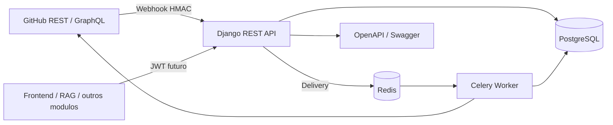

# Arquitetura inicial

## Portas e responsabilidades

| Porta | Adaptador | Responsabilidade |
| --- | --- | --- |
| Entrada HTTP | Django REST Framework | Webhooks, consultas, health e documentacao |
| Saida GitHub | `GitHubClient` | REST, timeout, CA customizada e rate limit |
| Persistencia | Django ORM / PostgreSQL | Repositorios, commits, PRs e entregas |
| Mensageria | Celery / Redis | Processamento assincrono e retry |
| Segredos | Variavel injetada em runtime | Chave mestre de AES-256-GCM |

## Fronteiras

O modulo indexa dados do GitHub e fornece fatos e metricas. Identidade institucional, interface grafica, chatbot e gestao de projetos pertencem a outros modulos. A IA deve consumir dados normalizados e produzir recomendacoes sem alterar o historico bruto.

## Riscos iniciais

| Risco | Mitigacao |
| --- | --- |
| Indisponibilidade do GitHub | Timeout, retry com backoff e health de conectividade |
| Rate limit | Inspecao dos headers e sincronizacao incremental |
| Webhook duplicado | Restricao unica em `X-GitHub-Delivery` |
| Webhook forjado | HMAC SHA-256 com segredo individual por repositorio |
| Vazamento de credencial | AES-256-GCM e chave mestre somente em runtime |
| Perda de evento | Persistencia da entrega antes do enfileiramento e reconciliacao futura |
| Identidade duplicada | Multiplos emails vinculados ao mesmo colaborador |

## Proximas decisoes

- Avaliar GitHub App como mecanismo principal; PAT deve ser apenas opcao de desenvolvimento.
- Introduzir DLQ operacional e reconciliacao periodica antes da primeira integracao real.
- Definir JWT compartilhado e contrato Pact com os modulos consumidores.
- Separar analytics/IA do pipeline de ingestao para preservar latencia do SLA de dois minutos.
